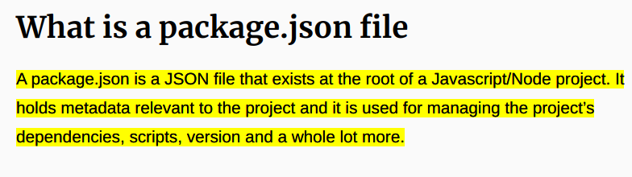

## Understanding NPM package.json and it's structure

### Nodejs
Node.js® is a JavaScript runtime built on Chrome's V8 JavaScript engine. 

### NPM (Node package manager)
npm is a package manager for the JavaScript programming language. AKA marketplace for packages.

Most popular packages such as react, lodash & moment.

https://areknawo.com/10-most-popular-npm-packages/

### package.json

https://blog.ezekielekunola.com/understanding-the-package.json-file

Dependencies version ranges
https://docs.npmjs.com/cli/v6/configuring-npm/package-json#dependencies

### node_modules
A folder that holds all your project's dependencies & recursive dependencies. Think of it like a cache for your project's dependencies. When you run `npm install` it will download & store your project dependencies in this folder. 

Do note that `node_modules` can grow really large when your project has many dependencies. Because of that you don't want to push `node_modules` to git. That's why `node_modules` folder is always ignored at `.gitignore`.

### package-lock.json
When you run `npm install`, `package-lock.json` file & `node_modules` folder will be created. Installed dependencies & it's exact version and path are stored inside `package-lock.json`. So for anyone using your project can clone your code & run `npm install` to get  dependencies with exact same version.
```
Describe a single representation of a dependency tree such that teammates, deployments, and continuous integration are guaranteed to install exactly the same dependencies.
```
https://stackoverflow.com/questions/44297803/what-is-the-role-of-the-package-lock-json